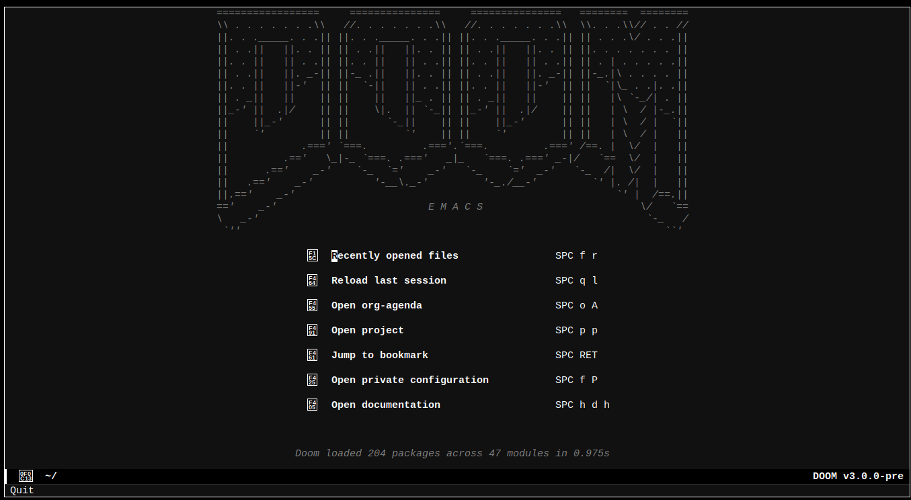

# doom-mono-dark-theme

[doom emacs faq.org](https://github.com/doomemacs/doomemacs/blob/master/docs/faq.org#how-do-i-change-the-theme)

``` shell

git clone https://github.com/KrzysztofMarciniak/doom-mono-dark-theme
```
$DOOMDIR/config.el:
``` emacs-lisp
(add-to-list 'custom-theme-load-path "~/doom-mono-dark-theme")
(setq doom-theme 'doom-mono-white-black)
```
